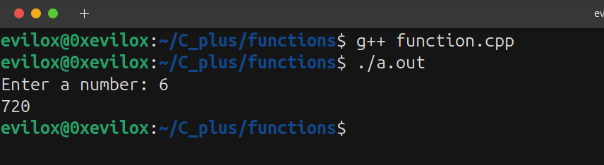

Hey Guys, Welcome to this blog.
Today We're going to talk about functions in C++ 
1. What is functions ?
2. How they work ?
3. How you use them to solve the problems in C++

## What is function in C++?

**Function** is a term that came from the **mathematics.** 

**For example:**
```
f(x) = x^2 + 2

Here x = 2;

f(2) = 2^2 + 2 = 4 + 2 = 6
```
Here x is parameter. you get value x from the user, and the function computes result based on the value.
In Programming, it's similar - but **not all function need to compute the value**. Some just perform actions without returing anything.
## Example: Print a Message Using a Function
```

#include <iostream>

using namespace std;

void printhappybirthday(void)
{
    cout << "Happy birthday evilox" << endl;  // it just print without returning anything
}

int main(void)
{
    printhappybirthday(); //calling the function
}

```
The above function doesn't compute the value. just print the birthday message.
In C++, a function is a series of the statement that is grouped together and given name to the function.


## Why use functions in C++?

- To reuse code, so you don't write the code agian and agian.
- To break big program into smaller manageable parts.

## Types of functions?

There are two types of functions:

1.Standard library functions:

- Standard library functions are built-in function and pre-defined function provided by the C++ language.
* Examples:
    * sqrt()
    * strlen()
    * sizeof()
    * tolower()
    * toupper()

2.User-defined functions:

- User-defined functions are custom function created by programmers to solve the specific problem.
* These helps programmer to organize code and make it reusable.

* These all are components to built the custom function:
    * return-type
    * function_name
    * parameters (optional)
    * function body 
    * return 

## How to write the function in C++?
```
return-type function_name(parameters)
{
		
		//function body

}
```

1. return-type: This is the type of the data the function will return at end.
* Common return type: 
    * Integer types: `short`,`int`,`long`.
    * Floating types: `float`,`double`.
    * Character: `char`
    * Boolean: `bool`
    * String: `string`
2. function_name: This is the name given to function.Which need be unique and descriptive.

3. parameters: parameters are dummy variable which helps us to take the input. (optional)

4. Function body: Function body the series of the statements and declaration which used inside the fuction.

### Rules for the functions return type
* You cannot return the array in the function and there are no other restriction 
* Specifying the return type is void means you cannot return anything.

## Writing a Function in C++

```
#include <iostream>

using namespace std;

int add(int a, int b)  // accepting the a and b parameter
{

	return a + b; // returing the integer

}

int main(void)
{
    int addnum = add(12,24); //calling the function and store in the addnum variable
    cout << addnum << endl;
}

```


In the above example:
- return type: int 
- function name: add
- parameters: a and b with there type 
- return the integers a + b => result 

## Solving Real Problem: Factorial Using Function

### Find the factorial of given number:
First, understand what a factorial is.
In mathematics,a factorial is the product of all integers less than or equal to a non-negative integers. (the symbol is `!`)
For example:
`5! = 5 * 4 * 3 * 2 * 1 = 120`
So here, we can clearly see that numbers loop from `1` to `n`.

### Alogrithm:
**Step 1:** Get the input from the user (i.e `n > 1`).

**Step 2:** Create a variable to store the product (i.e `factorial = 1`).

**Step 3:** Loop from 1 to n and multiply the number, storing the result in factorial.

**Step 4:** Return value at the end (i.e `return factorial`).

```
#include <iostream>

using namespace std;

int find_factorial(int n)
{
    if(n < 1)
    {
        cout << "Invalid number" << endl;
        return -1;
    }

    int factorial = 1;
    
    for(int i = 1; i <= n; i++)
    {
        factorial *= i;
    }
    
    return factorial;
}

int main(void)
{
    int num = 0;
    cout << "Enter a number: ";
    cin >> num;
    cout << find_factorial(num) << endl;
    return 0;
}
```


## How Does This Function Work?

In the `main` function,you get input from user using **cin** and store the value in num variable. Then you pass `num` to the function named find_factorial.

Inside that function:
* It first check wheather the `n` > 1 if it not it print **invalid number** and stop that function
* Then calcuate the factorial using the for loop and store the result in the factorial variable.
* Finally,it returns the `factorial` at end of the function.

## C++ Functions Consist of Three Parts:

1. **Function Declaration:** Define the function before using the function in our program which tells the compiler about function name,return type, and parameter. (it required if writing the function below main) and this called **function prototype**.
```
#include <iostream>

using namespace std;

int find_factorial(int n); //Function Declaration

int main(void)
{
    // main function
    return 0;
}

int find_factorial(int n)
{
    // write the program for factorial
}
```

2. **Function Definition:** Function is body of function or your actual code
```
int find_factorial(int n)
{
    // Function Definition
}
```
3. **Function Call:** This is when you use or invoke the function in your main program
```
#include <iostream>

using namespace std;

int find_factorial(int n);

int main(void)
{
    int num = 0;
    cout << "Enter a number: " << endl;
    cin >> num;
    find_factorial(num); // Function Call or Calling the function
    return 0;
}

int find_factorial(int n)
{
    // write the program for factorial
}
```
## Function Parameter and Argument in C++
Parameter are dummy variable hold the value passed by the arguments. 
Arguments are the actual value you give when you calling the function. 
So basically parameter receive  the data and argument send the data.

### Default parameters:
Default parameters when no value passed during the function call.
if you don't provide the argument, while calling the function default parameters used automatically.
```
#include <iostream>

using namespace std;

int find_factorial(int n = 2); // default parameters

int main(void)
{
    int num = 0;
    cout << "Enter a number: ";
    cin >> num;
    cout << find_factorial() << endl;
    return 0;
}

int find_factorial(int n = 2) // default parameters
{
    // factorial program
}
```
### Rules for arguments
1.**Implicit Conversion:** If you define the parameter as one type `(eg: integer type)` but pass a different type `(eg: floating point)` value and vice versa. C++ automically convert one type to other type `(eg: here float to int (lose the point value))`.
```
#include <iostream>

using namespace std;

int add(int a, int b);

int main(void)
{
    float i = 12.3;
    float j = 13.2;
    cout << add(i,j) << endl;
    return 0;
}

int add(int a, int b)
{
    return a + b;
}
```


2.**Default arguments promotion:** When you passing the small datatype values it get automatically convert:
* `float is promoted to double `
* `char and short are promoted to int`
```
int getNum(int a) // implict type conversion (default promotion)
{
    return a; 
}

int main(void)
{
    char a = 'A';
    cout << getNum(a); << endl; // implict type conversion (default promotion)
    return 0;
}
```
## Function Overloading in C++
Function Overloading is language feature provide by C++.
It allow you to define multiple function with the same name but different parameters size or different type of the parameter. 
If the you need overload the function you need follow two step:
1. Set different parameter for the function. (Multiple dummy variable).
```
int add(int a, int b) // 2 parameters
{
    return a + b;
}

int add(int a, int b, int c) // 3 parameters
{
    return a + b + c;
}
```
2. Set different datatype or size of datatype for the parameter.
```
int add(int a, int b)
{
    return a + b;
}

float add(float a, float b)
{
    return a + b;
}
```

### Use Case: Area Calculation Using Function Overloading
Find the **area of the rectange and square**


Since these concepts are already covered in school, I won't explain them in detail here.

```
#include <iostream>

using namespace std;

// Area of rectange
int area(int l, int b)
{
    return l * b;
}

// Area of square
float area(int l)
{
    return l * l;
}

int main(void)
{
    int l = 12;
    int b = 7;
    cout << area(l) << endl;
    cout << area(l,b) << endl;
    return 0;
}

```


## Final Thoughts on C++ Functions:
So, I hope you understand how function in C++ Works and we explored what functions are, how to write them, type of functions, function overloading and solving the problem using the functions in C++

Functions help you reuse code, organize logic, and make programs more readable.

Enjoyed this article?
Support the content by buying a coffee ☕

<center>
<script type="text/javascript" src="https://cdnjs.buymeacoffee.com/1.0.0/button.prod.min.js" data-name="bmc-button" data-slug="tamilcode" data-color="#5F7FFF" data-emoji="☕"  data-font="Lato" data-text="Buy me a coffee" data-outline-color="#000000" data-font-color="#ffffff" data-coffee-color="#FFDD00" ></script>
</center>
<br/>

Happy coding! 💻
